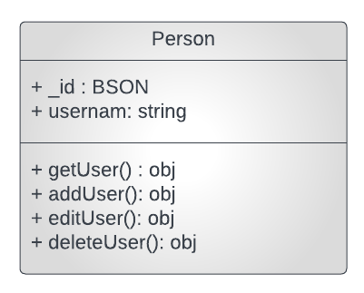
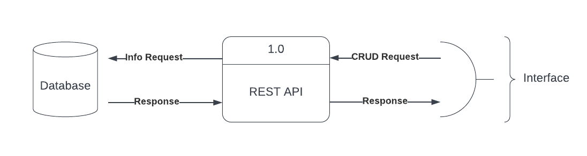

## REST API DOCUMENTATION

## Modelling 

### UML Diagram



### ERD Diagram




## API Endpoints

### Create a new person

```http://localhost:3000/api?person=john```

```json
{
    "id": 1,
    "username": "john"
}
```

## Retrieve all persons

```http://localhost:3000/api```

```json
[
    {
        id: ObjectId('650406d9fd043c5c018b0ebf')
        name: "Jack"
   },
    {
        _id : ObjectId('650406d9fd043c5c018b0ec0')
        name: "Jane"
    }
    {
        _id: ObjectId('650406d9fd043c5c018b0ec1')
        name :"Jackie"
    },
    {
        _id: objectId('650406d9fd043c5c018b0ec2')
        name: "Ann"
    }
]
```


## Retrieve One person by _id

```http://localhost:3000/api/:userId```

 * userId: id of the person to retrieve
 * returns: person if person with 'userId' exists, otherwise returns 'user not found'

```json
{
    "_id": ObjectId('650406d9fd043c5c018b0ec3'),
    "username": "John"
}
```


### Update person

```http://localhost:3000/api/:userId?person=NewJohn```

 * userId: id of the person to update
 * body: json object with the new username
 * returns: updated person if persone with 'userId' exists, otherwise returns 'user not found'

```json
{
    "_id": ObjectId('650406d9fd043c5c018b0ec3'),
    "username": "NewJohn"
}
```


### Delete person by userId

```http://localhost:3000/api/:userId```
    
* userId: id of the person to delete
* returns: deleted person if person with 'userId' exists, otherwise returns 'user not found'
    
    ```json
    {
        "_id": ObjectId('650406d9fd043c5c018b0ec3'),
        "username": "John"
    }
    ```
